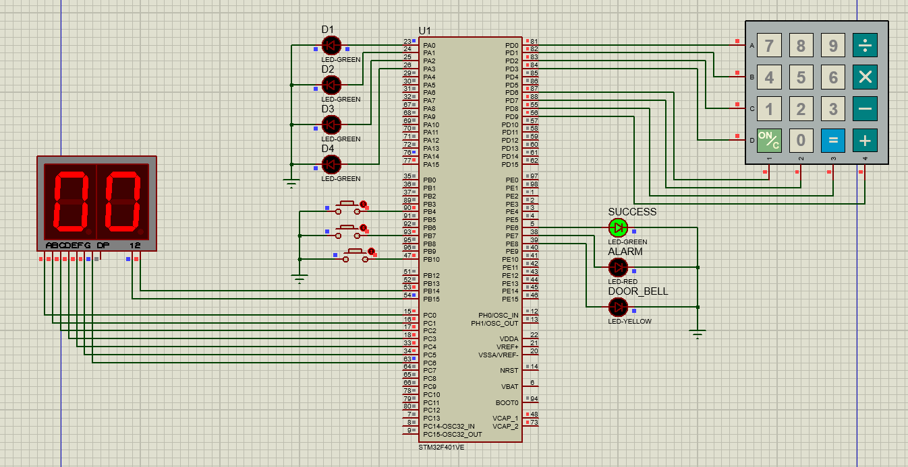

# 🔐 Project 2 — The Secure Keypad

> A bare-metal embedded security system for STM32F4, implementing a hardware-enforced password lock with interrupt-driven event handling and a strict Mealy State Machine architecture.

---

## 📋 Table of Contents

- [Overview](#overview)
- [Demo](#demo)
- [Hardware Components](#hardware-components)
- [System Architecture](#system-architecture)
- [State Machine](#state-machine)
- [Project Structure](#project-structure)
- [Driver Modules](#driver-modules)
- [Pin Mapping](#pin-mapping)
- [How It Works](#how-it-works)
- [Requirements Compliance](#requirements-compliance)

---

## Overview

This project implements a secure keypad lock system on a bare-metal STM32F4 microcontroller — no HAL, no RTOS, no external frameworks. Every register access, interrupt handler, and peripheral driver is written from scratch.

The system guards a 4-digit secret password entered via a 4×4 matrix keypad. It provides real-time visual feedback through a **dual 7-segment display** (showing values 00–99) and a bank of status LEDs, handles asynchronous hardware events (door bell, emergency reset) through EXTI interrupts, and enforces a lockout policy after **10 consecutive failures**.

---

## Demo

### 📹 Project Video


> [project_Demo](https://drive.google.com/file/d/1QJWxNRjBuj0nzRcQWqU4xxbcaTaAx7gW/view?usp=sharing)


### 🖼️ Project Images


### Proteus Simulation



---

## Hardware Components

| Component | Role |
|---|---|
| **4×4 Matrix Keypad** | Primary input device for digit entry |
| **Dual 7-Segment Display** | Shows current number of failed unlock attempts (00–99) |
| **Progress LEDs (×4)** | One LED lights per correctly entered digit |
| **Success LED (Green)** | Indicates the UNLOCKED state |
| **Alarm LED (Red)** | Indicates the ALARM / lockout state |
| **Door Bell LED (Yellow)** | Pulses when the door bell button is pressed |
| **Emergency Button (PB7)** | High-priority EXTI — resets system from ALARM |
| **Door Bell Button (PB10)** | Normal-priority EXTI — triggers bell indicator |
| **Lock Button (PB4)** | Polled (active LOW) — re-locks from UNLOCKED state |

---

## System Architecture

The system is built on a **Mealy State Machine** where every output and transition depends on both the **current state** and the **incoming event**. Event detection is split between:

- **Interrupt-driven** (asynchronous): Emergency Reset (EXTI line 7, high priority) and Door Bell (EXTI line 10, lower priority) set volatile flags in their ISRs.
- **Polled** (synchronous): The Lock Button and Keypad are scanned each cycle in `App_Update()`.

This separation ensures that time-critical hardware events are never missed, while the main loop remains clean and predictable.

```
┌─────────────────────────────────────────────────────────┐
│                        App_Update()                     │
│                                                         │
│  ISR flags → Emergency / DoorBell events                │
│  GPIO poll → Lock Button event                          │
│  Keypad scan → Digit input event                        │
│                          │                              │
│                          ▼                              │
│              ┌───────────────────────┐                  │
│              │   Mealy State Machine  │                  │
│              │  LOCKED / UNLOCKED /  │                  │
│              │       ALARM           │                  │
│              └───────────────────────┘                  │
│                          │                              │
│     Outputs: LEDs, Dual 7-Seg, State Transitions        │
└─────────────────────────────────────────────────────────┘
```

---

## State Machine

### STATE: LOCKED *(Initial State)*

| Event | Output | Next State |
|---|---|---|
| Valid digit entered | Light progress LED for that position | LOCKED (stay) |
| Full valid sequence entered | Clear progress → light Success LED, reset fail counter | **UNLOCKED** |
| Any wrong digit | Clear all progress LEDs, increment fail counter, update dual 7-seg | LOCKED (stay) |
| Fail count ≥ 10 | Activate Alarm LED | **ALARM** |
| Door Bell triggered | Pulse Bell LED (sequence progress untouched) | LOCKED (stay) |

### STATE: UNLOCKED

| Event | Output | Next State |
|---|---|---|
| Lock Button pressed | Clear Success LED, clear input buffer | **LOCKED** |
| Door Bell triggered | Pulse Bell LED | UNLOCKED (stay) |
| Any keypad input | *(Ignored)* | UNLOCKED (stay) |

### STATE: ALARM

| Event | Output | Next State |
|---|---|---|
| Emergency Reset (EXTI) | Clear Alarm LED, clear input, reset fail counter, update dual 7-seg | **LOCKED** |
| Any keypad input | *(Ignored)* | ALARM (stay) |

---

## Project Structure

```
Project2/
│
├── CoreLogic/              # [updated 6 min ago] 2 seven_segment use instead of 1
│   ├── App.h               # States, events, configuration constants
│   └── App.c               # State machine core + ISR callbacks
│
├── Exti/                   # Rcc and Exti implementation
│   ├── Exti.h              # EXTI public API & line/port/edge defines
│   └── Exti.c              # EXTI / NVIC interrupt driver
│
├── Gpio/                   # Gpio implementation
│   ├── Gpio.h              # Public GPIO API
│   ├── Gpio.c              # GPIO register-level driver
│   └── Gpio_private.h      # GpioType struct & base addresses
│
├── Keypad/                 # [updated 9 min ago] keypad_pins_modifications
│   ├── Keypad.h            # Keypad pin mapping & API
│   └── Keypad.c            # 4×4 matrix keypad driver with debounce
│
├── Lib/                    # utilities
│   └── STD_TYPES.h         # Platform-independent integer typedefs
│
├── Rcc/                    # Rcc and Exti implementation
│   ├── Rcc.h               # Public RCC API + peripheral IDs
│   ├── Rcc.c               # Clock enable/disable via bus routing
│   └── Rcc_private.h       # RCC register map
│
├── ledIndicator/           # led_indicators implementation
│   ├── led.h               # LED abstraction API
│   └── led.c               # Progress, success, alarm & bell LED control
│
├── sevenSeg/               # [updated 6 min ago] 2 seven_segment use instead of 1
│   ├── SevenSeg.h          # Dual 7-segment display API
│   └── SevenSeg.c          # Segment lookup table & GPIO mapping (tens + units)
│
├── main.c                  # Entry point — init + superloop
├── CMakeLists.txt          # Build configuration
└── README.md
```

---

## Driver Modules

### GPIO (`Gpio.c`)
Direct register-level control of STM32F4 GPIO peripherals.
- `Gpio_Init(port, pin, mode, state)` — configures MODER, PUPDR, OTYPER
- `Gpio_WritePin(port, pin, data)` — writes to ODR (output only)
- `Gpio_ReadPin(port, pin)` — reads from IDR

### EXTI (`Exti.c`)
External interrupt configuration via SYSCFG, EXTI, and NVIC registers.
- `Exti_Init(line, port, edge, callback)` — maps GPIO pin to EXTI line, registers ISR callback, configures edge trigger
- `Exti_Enable(line)` / `Exti_Disable(line)` — controls IMR and NVIC ISER/ICER
- `Exti_SetPriority(line, priority)` — configures NVIC interrupt priority
- Shared handlers (`EXTI9_5_IRQHandler`, `EXTI15_10_IRQHandler`) properly demux by checking the pending register

### Keypad (`Keypad.c`)
Row-scanning matrix keypad driver with software debounce.
- Rows driven LOW one at a time; columns read as pulled-up inputs
- 30 ms debounce delay on key detection
- Returns `KEY_IDLE (0xFF)` when no key is pressed

### LED (`Led.c`)
Abstraction layer over GPIO for all LED indicators.
- `Led_SetProgress(index, state)` — individual digit-progress LEDs
- `Led_ClearProgress()` — turns off all 4 progress LEDs
- `Led_SetSuccess(state)` / `Led_SetAlarm(state)` — status LEDs
- `Led_PulseBell()` — momentary bell pulse with blocking delay
- `Led_SetBell(state)` — direct bell LED control (on/off)

### Dual 7-Segment Display (`SevenSeg.c`)
Two-digit segment-mapped display driver using a lookup table.
- Encodes digits 0–9 into a 7-bit segment map (`0x3F`, `0x06`, … `0x6F`)
- **Tens digit** mapped to a dedicated GPIO pin group (first display)
- **Units digit** mapped to a second GPIO pin group (second display)
- Displays failure count range **00–99**
- `sevenSegDisplay(value)` — automatically splits value into tens and units, drives both displays

### RCC (`Rcc.c`)
Peripheral clock management.
- Bus routing computed from peripheral ID (`id / 32` → bus, `id % 32` → bit)
- Supports AHB1, AHB2, APB1, APB2

---

## Pin Mapping

### Keypad
| Signal | Port | Pin |
|---|---|---|
| Row 0 | GPIOD | 5 |
| Row 1 | GPIOD | 6 |
| Row 2 | GPIOD | 7 |
| Row 3 | GPIOD | 8 |
| Col 0 | GPIOD | 0 |
| Col 1 | GPIOD | 1 |
| Col 2 | GPIOD | 2 |
| Col 3 | GPIOD | 3 |

### Buttons
| Button | Port | Pin | Mode |
|---|---|---|---|
| Lock | GPIOB | 4 | Polled, Active LOW, Pull-Up |
| Emergency Reset | GPIOB | 7 | EXTI Falling Edge, High Priority |
| Door Bell | GPIOB | 10 | EXTI Falling Edge, Normal Priority |

### LEDs
| LED | Port | Pin |
|---|---|---|
| Progress 0–3 | GPIOA | 0–3 |
| Success (Green) | GPIOE | 6 |
| Alarm (Red) | GPIOE | 7 |
| Bell (Yellow) | GPIOE | 8 |

### 7-Segment Displays
| Display | Segments | Port | Pins |
|---|---|---|---|
| Units digit (ones) | A–G | GPIOC | 0–6 |
| Tens digit | A–G | GPIOC | 7–13 *(or second port — update per your wiring)* |

> ⚠️ Update the tens digit pin mapping above to match your actual hardware wiring.

---

## How It Works

1. **Power on** — system initialises in `STATE_LOCKED`. Failure counter = 0, dual 7-seg shows `00`.
2. **Digit entry** — each keypad press is scanned. A correct digit lights the next progress LED. A wrong digit clears all progress LEDs and increments the failure counter (displayed on the dual 7-segment as a two-digit number).
3. **Unlock** — entering all 4 correct digits in sequence transitions to `STATE_UNLOCKED`. The success LED turns on and the failure counter resets to `00`.
4. **Re-lock** — pressing the Lock Button from `STATE_UNLOCKED` turns off the success LED and returns to `STATE_LOCKED`.
5. **Lockout** — **10 consecutive failed attempts** trigger `STATE_ALARM`. The alarm LED lights. Keypad input is ignored.
6. **Emergency reset** — pressing the Emergency Button (EXTI, high priority) from any state clears the alarm, resets the counter to `00`, and returns to `STATE_LOCKED`.
7. **Door Bell** — pressing the Door Bell button at any time pulses the Bell LED momentarily. It does **not** affect current state or input progress.

---

## Requirements Compliance

| Requirement | Implementation |
|---|---|
| 4×4 Matrix Keypad driver | `Keypad.c` — row-scan with pull-up columns and 30 ms debounce |
| Emergency Reset as high-priority EXTI | `Exti_SetPriority(EMERGENCY_BTN_PIN, 0)` in `App_Init()` |
| Door Bell as normal-priority EXTI | `Exti_SetPriority(DOORBELL_BTN_PIN, 1)` in `App_Init()` |
| Door Bell does not disrupt lock state | Bell handled as a side-effect only; state machine untouched |
| **Dual 7-Segment displays failed attempts (00–99)** | `sevenSegDisplay(failureCount)` drives tens + units digit on two displays |
| Progress LEDs per correct digit | `Led_SetProgress(inputIndex, 1)` per valid digit |
| Dedicated Success and Alarm LEDs | `Led_SetSuccess()` / `Led_SetAlarm()` on separate GPIOE pins |
| Mealy State Machine architecture | `handleLocked()`, `handleUnlocked()`, `handleAlarm()` — outputs tied to (state, event) pairs |
| **Lockout after 10 consecutive failures** | `LOCKOUT_THRESHOLD = 10`, checked after every failure |
| Alarm cleared only by Emergency Reset | `handleAlarm()` only responds to `EVENT_EMERGENCY` |
| All register access is direct / bare-metal | No HAL, no CMSIS — raw struct pointers to hardware base addresses |

---

> **Target MCU:** STM32F401/F411 (STM32F4 family)
> **Language:** C (C99)
> **Toolchain:** GCC ARM / CLion + OpenOCD
> **Simulation:** Proteus
